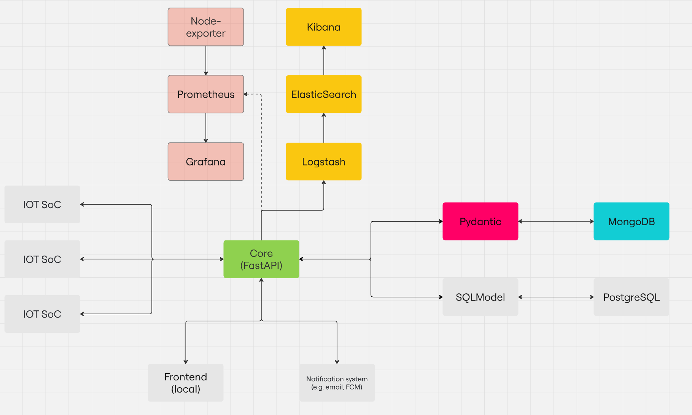

# Web Application with FastAPI

## Description
This project is a web application built using FastAPI, designed to be easily built, logged, and monitored. It includes an automated build process using Docker Compose, logging using the ELK stack (Elasticsearch, Logstash, Kibana), and monitoring using Prometheus, Kibana, and Node Exporter. The project emphasizes security and data control.

## Setup Instructions
1. **Clone the repository:**
   ```bash
   git clone git@github.com:LavrentevAndrey/System-Design-Practice.git
   cd System-Design-Practice
   ```

2. **Build the Docker containers:**
   ```bash
   docker-compose build
   ```

3. **Start the services:**
   ```bash
   docker-compose up -d
   ```

4. **Access the application:**
   - The FastAPI application will be available at `http://http://localhost:8989/`.
   - The API documentation will be available at `http://localhost:8989/docs`.

## Usage Instructions
- **Run the application:**
  ```bash
  docker-compose up -d
  ```

- **Stop the application:**
  ```bash
  docker-compose down
  ```

- **View logs:**
  ```bash
  docker-compose logs -f
  ```

## Monitoring and Logging
- **Prometheus:** Access at `http://localhost:9090`.
- **Grafana:** Access at `http://localhost:3000` (Default creds: admin admin  Dashboard: 1860 Default data source: Prometheus) 
- **Kibana:** Access at `http://localhost:5601` (Default creds: elastic changeme).
- **Node Exporter:** Metrics available at `http://localhost:9100/metrics`.

## Security and Data Control
- **Authentication and Authorization:** Implemented using OAuth2.
- **Data Validation:** All data is validated using Pydantic models.
- **Environment Variables:** Sensitive information is managed using environment variables (see `.env` file).

## Principal scheme of project

- All light gray elements is not yet implemented.
- MongoDB was used for educational porpouses. In near future it will be replaced with PostgreSQL.